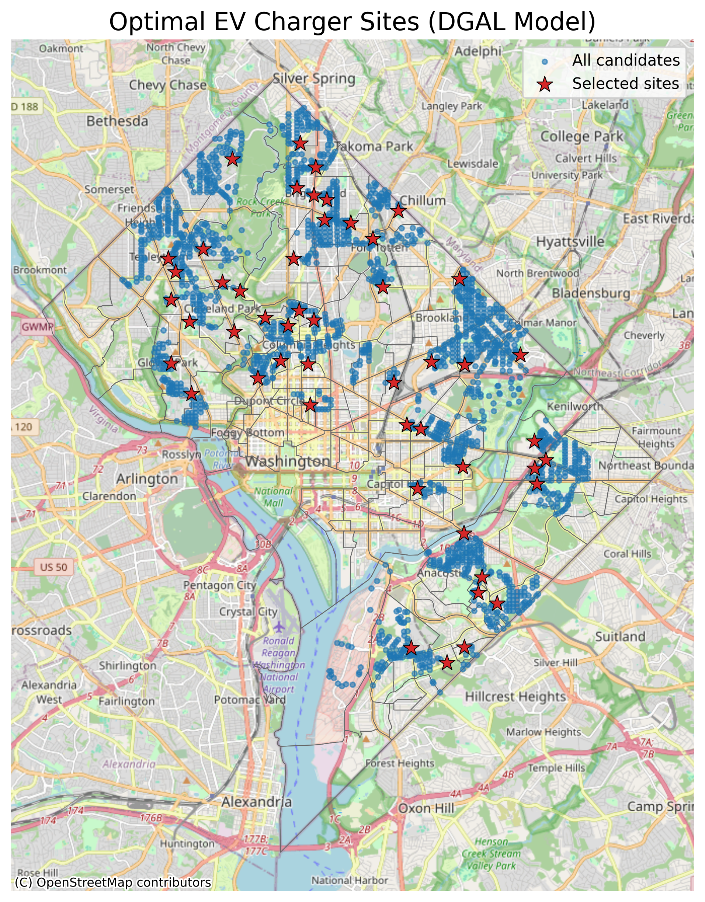

# EV Charging Infrastructure Optimizer (DGAL Model)

A geospatial decision support system for optimizing EV charging station placement across Washington D.C. using binary integer programming. Built as a graduate research project at George Mason University (CS787) and published in IEEE format.



## Research Paper

**[Optimizing Public EV Charging Infrastructure Through Geospatial and Socioeconomic Analysis](report/ev_dgs_report.pdf)**  
Singh, A., Meka, S.R., Sunkavalli, S.H. — George Mason University, CS787, 2024. IEEE Format.

> **My contribution (Sri Harsha Sunkavalli):** Model Development & Feature Engineering — designed and implemented the core DGAL binary integer programming model (`scripts/dgal_model.py`), composite demand scoring system combining population, income and infrastructure gap features (`scripts/enrich_candidate_sites.py`), and sensitivity analysis across 36 optimization scenarios.

---

## What It Does

Given 1,000+ candidate locations across Washington D.C., the system selects the optimal subset of EV charging sites that:
- **Maximizes demand coverage** across census tracts weighted by population and income
- **Minimizes redundancy** by enforcing minimum distance constraints between sites
- **Balances equity** by ensuring coverage across all demographic quintiles
- **Visualizes results** in an interactive Streamlit + Folium web app

## Key Results

- **72.3% tract coverage** (217 of 300 D.C. census tracts served) with just 50 chargers
- **78.5% population coverage** across Washington D.C.
- Improved from **21.7% to 72.3%** tract coverage vs. existing infrastructure
- Evaluated **1,000+ candidate sites** with full sensitivity analysis across 36 parameter scenarios
- CBC solver finds optimal solution in **~15 seconds** on standard hardware

## Tech Stack

| Component | Technology |
|---|---|
| Optimization | Pyomo + CBC solver (binary integer programming) |
| Geospatial | GeoPandas, Shapely, SciPy (KD-tree spatial indexing) |
| Data Sources | U.S. Census ACS 2022, NREL AFDC, D.C. Open Data |
| Web App | Streamlit + Folium (interactive maps) |
| Analysis | Python, NumPy, Pandas, Matplotlib |

## DGAL Optimization Model

The core model is a binary integer program:

**Maximize:** `Σ demand_score(i) * x(i) + α * Σ y(j)`

**Subject to:**
- `Σ x(i) ≤ N` — budget constraint (max chargers)
- `y(j) ≤ Σ x(i) for i in tract j` — coverage constraint
- `x(i) + x(k) ≤ 1` for sites closer than min_distance — no clustering
- `x(i), y(j) ∈ {0,1}` — binary variables

Where `demand_score = 0.3 × pop_norm + 0.3 × income_norm + 0.4 × distance_norm`

## Project Structure

```
ev-dgs/
├── app.py                          # Streamlit web app (UI & Backend)
├── config.py                       # Model parameters and defaults
├── scripts/
│   ├── dgal_model.py               # Core DGAL optimization model
│   ├── optimize.py                 # Optimization pipeline
│   ├── enrich_candidate_sites.py   # Feature engineering + demand scoring
│   ├── calc_demand.py              # Demand score computation
│   ├── merge_data.py               # Data integration pipeline
│   ├── fetch_dc_data.py            # NREL API data acquisition
│   └── evaluate_results.py         # Coverage & equity metrics
├── data/
│   ├── raw/                        # Census, traffic, street shapefiles
│   ├── cleaned/                    # Processed GeoJSON datasets
│   └── processed/                  # Model-ready candidate sites
├── figures/                        # Output maps and visualizations
└── report/
    └── cs787-projectReport-EVDGS.pdf  # IEEE research paper
```

## Setup & Run

### Install dependencies

**Windows (recommended):**
```bash
conda create -n ev-dgal python=3.9
conda activate ev-dgal
conda install -c conda-forge gdal geopandas pyomo coinor-cbc folium streamlit streamlit-folium geopy
pip install pandas requests scipy scikit-learn
```

**macOS:**
```bash
brew install gdal geos proj coinor-cbc
pip install -r requirements.txt
```

### Run the web app
```bash
streamlit run app.py
```

### Run optimization directly
```bash
python scripts/optimize.py \
  --candidate_geojson data/processed/candidate_sites_prepped.geojson \
  --tract_geojson data/cleaned/census_tracts_cleaned.geojson \
  --N_sites 50 \
  --coverage_weight 25.0 \
  --min_distance 750.0 \
  --output_path data/processed/optimal_sites_dgal.geojson
```

## Model Parameters

| Parameter | Default | Description |
|---|---|---|
| N_sites | 50 | Number of chargers to place |
| coverage_weight (α) | 25.0 | Weight for covering new tracts vs. demand |
| min_distance | 750m | Minimum spacing between any two chargers |

## Visualizations

| File | Description |
|---|---|
| `figures/optimal_sites_map.png` | Final 50 selected charging locations on D.C. map |
| `figures/coverage_map.png` | Coverage density across census tracts |
| `coverage_heatmap.png` | Distance-to-charger heatmap across D.C. |
| `coverage_by_quintile.png` | Equity analysis across income quintiles |
| `tradeoff_demand_coverage.png` | Pareto frontier of demand vs. coverage weight |
| `sensitivity_objective_n_sites.png` | Sensitivity of objective vs. number of sites |
| `solver_performance.png` | CBC solver runtime across parameter settings |

## Academic Context

**Course:** CS787 — Decision Guidance Systems, George Mason University  
**Authors:** Abhishek Singh, Sai Risheesh Meka, Sri Harsha Sunkavalli  
**Focus:** Multi-objective binary integer programming for equitable urban infrastructure placement

## Author

**Sri Harsha Sunkavalli** — UI & Backend Integration  
MS Computer Science, George Mason University (GPA: 3.83)  
[LinkedIn](https://www.linkedin.com/in/harsha-sunkavalli) | [Email](mailto:smasriharsha@gmail.com)
